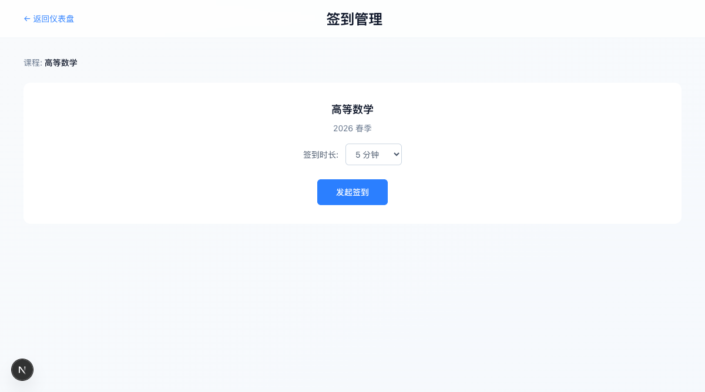
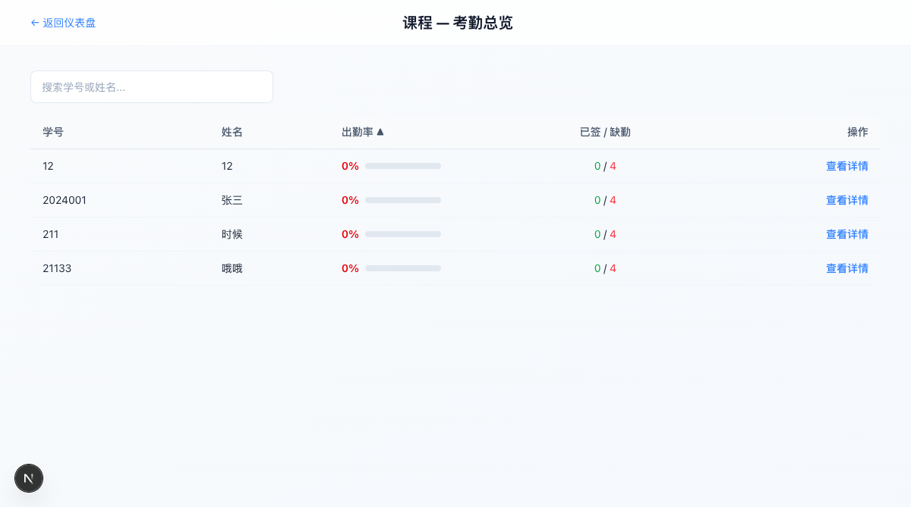
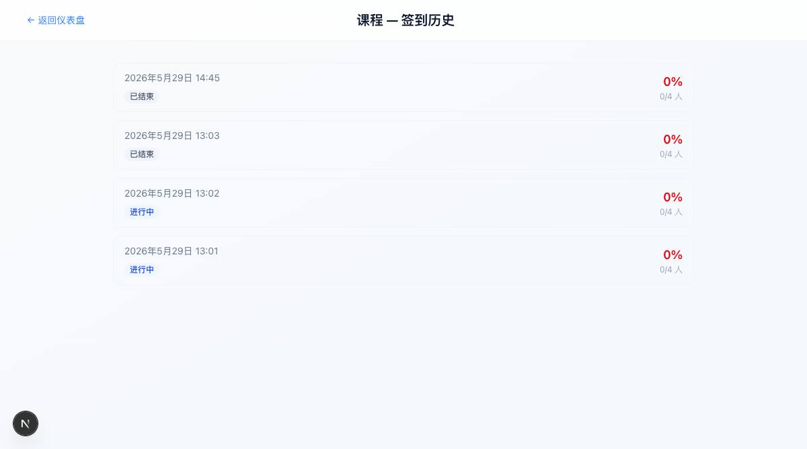
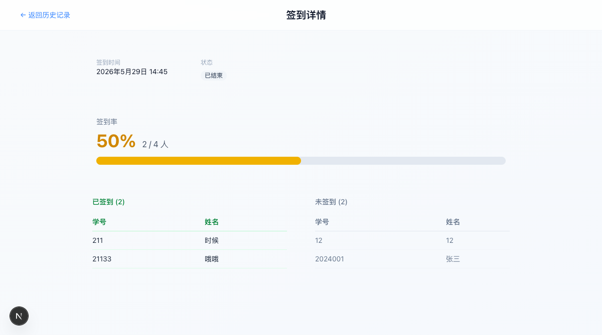

<div align="center">

# 📚 CourseCheckIn

**课程签到系统**

一个轻量级在线课程签到系统，支持 WebSocket 实时推送、二维码扫码签到、考勤统计。

[](https://nextjs.org/)
[](https://react.dev/)
[](https://www.postgresql.org/)
[](https://orm.drizzle.team/)
[](https://github.com/websockets/ws)
[](LICENSE)

---

<p align="center">
  
  
  
</p>

<p align="center">
  
  
  
</p>

---

</div>

## ✨ 功能特性

<table>
<tr>
<td>🔐 <b>老师认证</b><br/><small>首次自注册，JWT + HTTP-only Cookie</small></td>
<td>📚 <b>课程管理</b><br/><small>创建、删除课程，独立管理学生名单</small></td>
</tr>
<tr>
<td>👥 <b>学生管理</b><br/><small>添加/移除学生，学号+姓名唯一标识</small></td>
<td>📱 <b>扫码签到</b><br/><small>发起签到生成二维码，学生扫码完成签到</small></td>
</tr>
<tr>
<td>🔄 <b>自动注册</b><br/><small>首次签到的学生自动加入课程</small></td>
<td>⏱ <b>时长可设</b><br/><small>签到时长 1~30 分钟可选，倒计时自动结束</small></td>
</tr>
<tr>
<td>⚡ <b>实时推送</b><br/><small>WebSocket 推送签到人数、已签/未签列表</small></td>
<td>📊 <b>实时看板</b><br/><small>彩色签到率进度条、双栏学生名单</small></td>
</tr>
<tr>
<td>📋 <b>签到历史</b><br/><small>查看所有历史签到及详情</small></td>
<td>📈 <b>考勤统计</b><br/><small>按学生查看出勤率，课程级考勤总览</small></td>
</tr>
</table>

## 🛠 技术栈

| 类别 | 技术 | 用途 |
|------|------|------|
| **框架** | Next.js 16 + React 19 | 全栈框架 (UI + API Routes) |
| **样式** | Tailwind CSS 4 | Utility-first 样式 |
| **数据库** | PostgreSQL 17 + Drizzle ORM | 关系型数据库 + 类型安全的 ORM |
| **实时通信** | ws (WebSocket) | 签到实时推送 |
| **认证** | JWT (jose) + bcryptjs | HTTP-only Cookie 会话管理 |

## 🚀 快速开始

### 前置要求

- Node.js 22+
- PostgreSQL 17+（推荐 Docker）

### 1. 启动数据库

```bash
docker run -d \
  --name coursecheckin-db \
  -e POSTGRES_USER=coursecheckin \
  -e POSTGRES_PASSWORD=coursecheckin \
  -e POSTGRES_DB=coursecheckin \
  -p 5432:5432 \
  postgres:17-alpine
```

### 2. 配置环境

```bash
cp .env.example .env
# 编辑 DATABASE_URL 和 JWT_SECRET
```

### 3. 安装并初始化

```bash
npm install
npm run db:push     # 初始化数据库表
```

### 4. 启动

```bash
# 开发模式（HTTP + WebSocket）
npm run dev:server
```

访问 `http://localhost:3000/setup` 创建第一个账号。

> **默认测试账号：** 用户名 `testteacher` / 密码 `password123`

## 📂 项目结构

```
src/
├── app/
│   ├── (public)/login/     # 登录页
│   ├── (public)/setup/     # 首次设置
│   ├── (protected)/dashboard/  # 仪表盘 + 课程卡片
│   ├── api/                # API 路由
│   │   ├── auth/           # 登录/登出
│   │   ├── courses/        # 课程 CRUD、学生、签到历史、考勤
│   │   ├── sessions/       # 签到会话
│   │   ├── checkin/        # 学生签到
│   │   └── students/       # 学生考勤
│   └── checkin/            # 学生签到页面
├── db/schema/              # Drizzle 数据表定义
└── lib/
    ├── auth.ts             # JWT 认证
    ├── checkin-service.ts  # 签到业务逻辑
    ├── ws-broadcast.ts     # WebSocket 广播
    ├── ws-types.ts         # WS 消息协议
    └── use-checkin-session.ts  # WS React Hook
```

## 📄 页面路由

| 路由 | 说明 |
|------|------|
| `/login` | 老师登录 |
| `/setup` | 首次创建账号 |
| `/dashboard` | 课程仪表盘 |
| `/checkin?session=xxx` | 学生签到表单 |
| `/checkin/[courseId]` | 老师签到管理（二维码 + 看板） |
| `/dashboard/courses/[id]/history` | 签到历史列表 |
| `/dashboard/courses/[id]/history/[sessionId]` | 签到详情 |
| `/dashboard/courses/[id]/attendance` | 考勤总览 |
| `/dashboard/courses/[id]/attendance/[studentId]` | 学生考勤详情 |

## 🔌 API 一览

| 方法 | 路径 | 说明 |
|------|------|------|
| POST | `/api/auth/login` | 登录 |
| GET | `/api/courses` | 课程列表 |
| POST | `/api/courses` | 创建课程 |
| DELETE | `/api/courses/[id]` | 删除课程 |
| GET/POST/DELETE | `/api/courses/[id]/students` | 学生管理 |
| POST | `/api/sessions` | 创建签到 |
| GET/PATCH | `/api/sessions/[sessionId]` | 签到状态/结束 |
| POST | `/api/checkin/submit` | 学生签到提交 |
| GET | `/api/courses/[id]/sessions` | 签到历史 |
| GET | `/api/courses/[id]/attendance-summary` | 考勤汇总 |
| GET | `/api/students/[studentId]/attendance` | 学生考勤记录 |

## 🧪 局域网测试

教室场景下，手机扫码测试：

```env
# .env 中设置局域网 IP
NEXT_PUBLIC_BASE_URL=http://192.168.x.x:3000
```

老师用电脑浏览器访问 `localhost:3000`，学生手机扫码走 `NEXT_PUBLIC_BASE_URL`。

## 📜 License

[MIT](LICENSE)

---

<div align="center">
  <sub>Built with ❤️ for better classroom attendance</sub>
</div>
